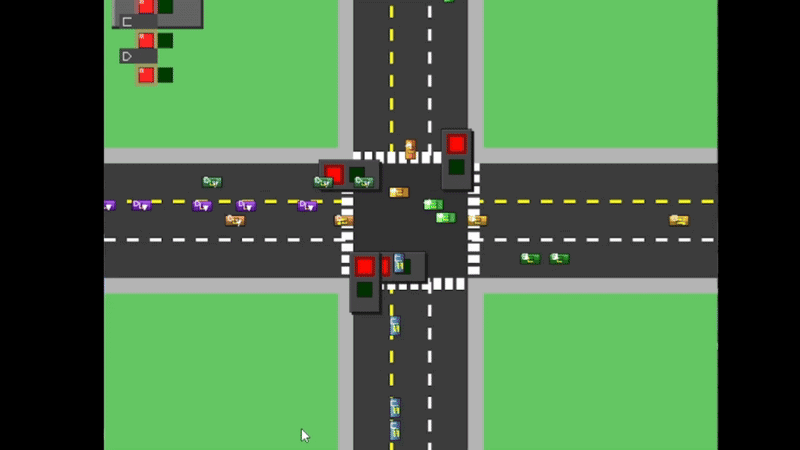

This is a great traffic junction simulator project! The queue-based traffic management system is an effective way to demonstrate key concepts of data structures, particularly in simulating real-world traffic conditions.

Here’s a brief breakdown of the key points:

🚦 Traffic Management Features
Queue-Based System: The use of queues, particularly for managing the flow of vehicles in various lanes, is fundamental. This approach is efficient for maintaining the order of vehicles and simulating waiting times.

Priority Lane: Lane A2 receiving priority when it has more than 10 vehicles is a practical feature, mimicking real-world scenarios like bus lanes or emergency vehicle lanes, where they are given priority.

Free Lane Routing: Lane L3, which always allows left turns, adds another layer of realism, ensuring that the free-turning vehicles don't get delayed by the traffic light conditions.

🧠 Data Structures & Algorithms
Queue: The use of a basic queue for managing vehicle flow in each lane adheres to the FIFO principle. This is perfect for modeling how cars move through lanes.

Priority Queue: Ensuring that lane A2 gets priority when needed adds more complexity and simulates real-world traffic management (such as bus priority or emergency vehicle handling).

Traffic Light Calculation: The dynamic traffic light timing, based on the number of vehicles, ensures that light changes happen based on real-time conditions, creating a responsive system that adapts to traffic congestion.

🛠️ Implementation Steps
Installation: The instructions are clear and straightforward, covering all the necessary steps for setting up SDL3 and building the project on various operating systems.

Running the Simulation: It's great that the process involves running two separate components — the traffic generator and the simulator — for a more interactive experience.

🌐 Real-World Application
The design and rules in this simulator are useful in the real world, where traffic management systems need to:

Adapt to varying traffic flows
Manage priority lanes (e.g., for buses or emergency vehicles)
Allow flexibility for turning lanes
🔄 Potential Enhancements
Pedestrian Crossing Simulation: Adding crosswalks with traffic lights could provide additional complexity and realism.
Vehicle Type Variations: Vehicles of different sizes (like trucks vs cars) might have different handling times at intersections.
Traffic Flow Optimization: Implementing algorithms that optimize traffic flow based on real-time data (like adjusting light timings dynamically).
This project is a solid implementation of a queue-based simulation that tackles a practical problem with relevant data structures and algorithms. It's a good representation of how software can mimic real-world scenarios!

